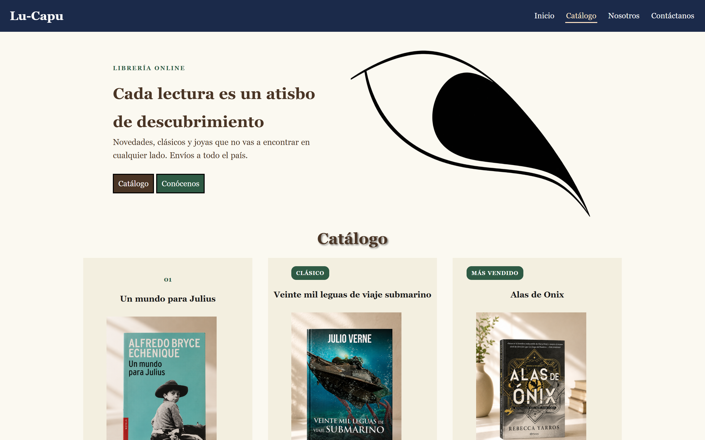
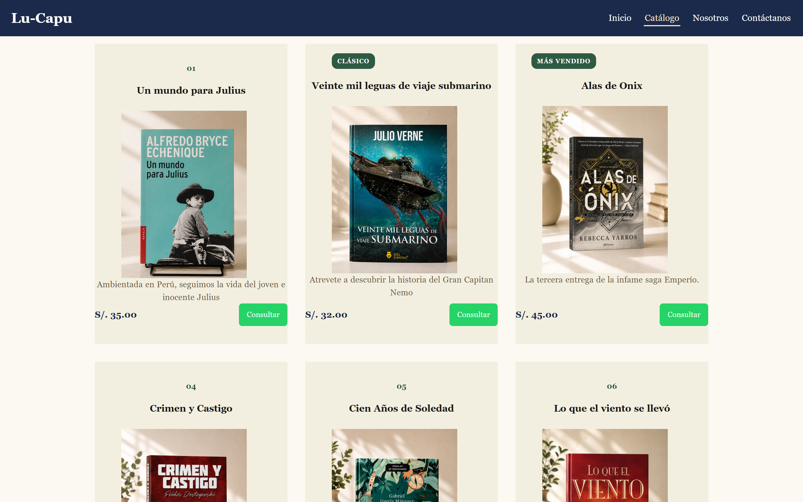
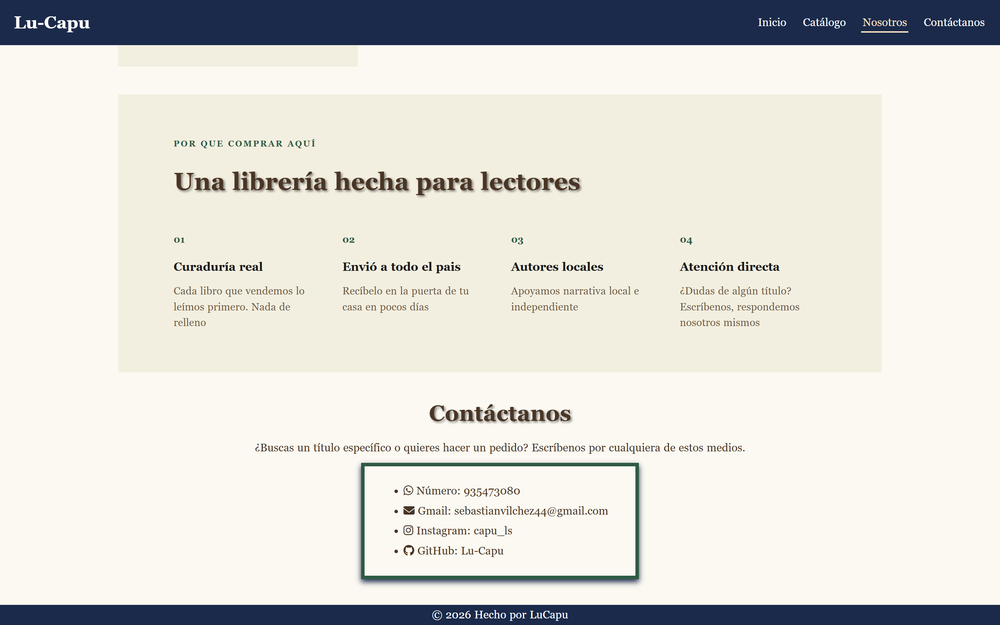
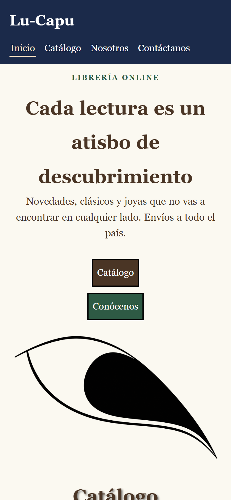

# Librería Online · Landing Page

Landing page de una librería online con catálogo de libros, integrada con
WhatsApp Business para consultas. El botón "Consultar" de cada libro genera un
mensaje prellenado con el título y el precio, y abre el chat.



## 🛠️ Tecnologías


Cero dependencias de JavaScript. Los iconos vienen por CDN.

## ✨ Características

- **Catálogo de 7 libros** con portada, descripción, precio en soles y etiquetas
  (`Clásico`, `Más Vendido`)
- **Integración con WhatsApp Business:** cada botón "Consultar" arma el mensaje
  con el título y el precio del libro, y lo envía a un número predefinido
- **Navegación activa por scroll** con `IntersectionObserver` y `rootMargin` para
  resaltar la sección que el usuario está viendo
- **Menú con anclas** a Inicio, Catálogo, Nosotros y Contacto
- **Sección de contacto** con WhatsApp, correo, Instagram y GitHub
- **Precios y descripciones leídos del DOM**, no duplicados en el JavaScript
- **Responsive** con CSS Grid
- **Accesible:** `alt` descriptivo en cada imagen, `rel="noopener noreferrer"`
  en todos los enlaces externos y jerarquía correcta de encabezados

## 🚀 Instalación y uso

No requiere instalación:

```bash
git clone https://github.com/Lu-Capu/landing-libreria.git
cd landing-libreria
npx serve .
```

## 📁 Estructura

```
landing-libreria/
├── index.html    # Contenido y estructura
├── style.css     # Estilos
├── index.js      # Integración con WhatsApp y scroll-spy
└── img/          # Portadas de los libros y logos
```

## ✏️ Personalización

| Quiero cambiar... | Dónde |
|---|---|
| Número de WhatsApp | La constante `numero` en `index.js` (línea 9) |
| Texto del mensaje prellenado | La plantilla `mensaje` en `index.js` |
| Libros del catálogo | Duplica un `<li class="subLista">` en `index.html` |
| Colores y tipografías | Las variables al inicio de `style.css` |

## 📸 Capturas

**Catálogo** — cada tarjeta con su botón de consulta por WhatsApp



**Nosotros y contacto**

| Nosotros | Contacto |
|---|---|
|  |  |

**Vista móvil**



## 🔗 Demo en vivo

[▶ Ver demo](https://lu-capu.github.io/landing-libreria/) · [💻 Ver código](https://github.com/Lu-Capu/landing-libreria)

## 📞 Nota sobre los datos de contacto

El número de WhatsApp, el correo y las redes sociales están hardcodeados en
`index.js` (línea 9) y en la sección `#Contacto` de `index.html`. Reemplázalos
por los tuyos antes de reutilizar el proyecto.

## 📄 Licencia

[MIT](LICENSE)
